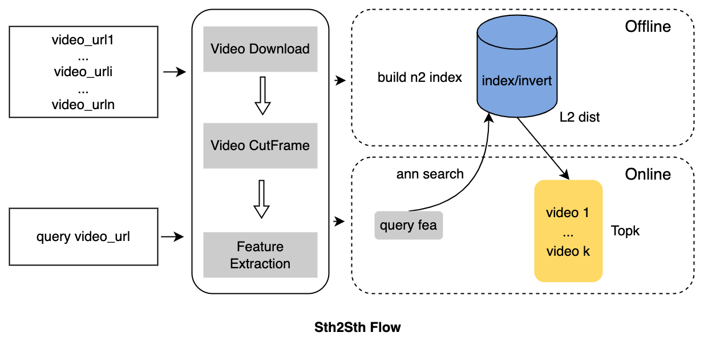

# Something to Something

[![python-image]][python-url]
[![lic-image]][lic-url]

这是一个基于Python3所搭建的图像检索系统，目前该系统实现了**以影搜影**功能。

## 设计思路

<p align="center"></p>

系统设计主要包括两个部分：

- 离线建库：对于存量数据进行预处理--特征提取--建库等操作，得到倒排索引；
- 在线索引：对于增量query进行预处理--特征提取--近邻索引，得到TopK相似结果。

## Demo展示

<p align="center"></p>

## 快速开始

### 安装依赖

```pip3 install -r requirements.txt```

### 启动服务

```python3 web_server.py```

### 快速体验

```localhost:8991```

## Note

由于本人前端开发能力有限，在实现系统时很多地方设计并不合理，希望可以遇到一个对前端比较熟悉的小伙伴，如果对该项目也有兴趣可以一起进行完善～

感兴趣的小伙伴可以在issue里留言哦～

## TODO

- [x] 以影搜影
- [ ] 以图搜影
- [ ] 以图搜图
- [ ] 以文搜影
- [ ] 以文搜图

# Reference

- [WebCBIR](https://github.com/ledleledle/WebCBIR)

<!--
[![python-image]][python-url]
[![lic-image]][lic-url]
-->

[python-image]: https://img.shields.io/badge/Python-3.x-ff69b4.svg
[python-url]: https://www.python.org/
[lic-url]: https://github.com/Tramac/sth-2-sth/blob/main/LICENSE

